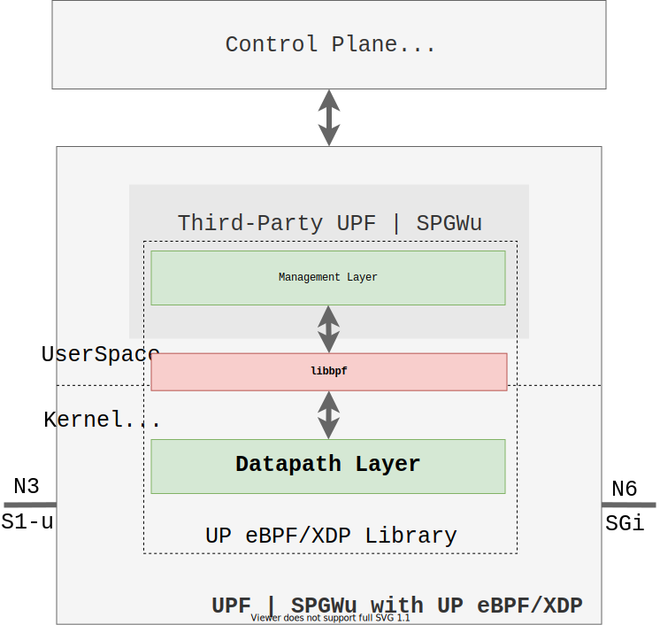
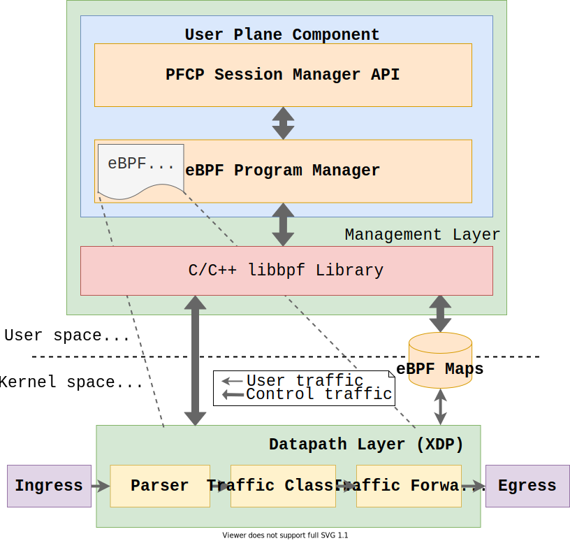
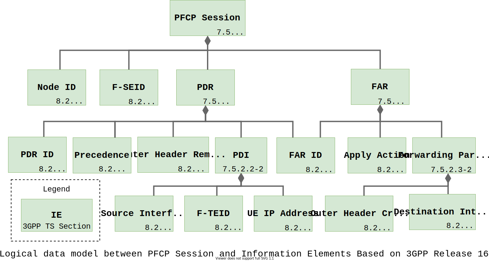

# 5G UPF using eBPF/XDP

An open source C++ library powered by eBPF/XDP for user plane in mobile core network (5G/LTE).

The key pillars of this project are:

- In-kernel fast packet processing
- Flexible and programmable dataplane
- Portable to different systems

These points are achieved mainly by eBPF/XDP and CO-RE (Compile Once - Run Everywhere) technologies.

This project is based on the following 3GPP Technical Specification:
- LTE; 5G; Interface between the Control Plane and the User Plane nodes (3GPP TS 29.244 version 16.5.0 Release 16)
- 5G; System architecture for the 5G System (5GS) (3GPP TS 23.501 version 16.5.0 Release 16)

The main goal is to enable in-kernel fast packet processing in third-party UPF/5G or SPGWu/LTE components in order to:
1. Boost them for those which does not have any fast packet processing enabled, or
2. Co-locate them with other fast packet processing solutions (e.g. DPDK)

Possible scenarios that take advantage of this type of technology: MEC, 5G NPN (Non Public Networks), on-premise, 5G enterprise, and much more.

## Design

The library is divided in layers:
- **Management Layer**: An user space layer responsible to receive requests from the third-party UPF/SPGWu components to manage PFCP sessions and eBPF programs lifecycle
- **Datapath Layer**: A kernel space layer representing by eBPF/XDP programs responsible to handle the user traffic (datapath) for fast packet processing

The high level design is shown in figure below.



The library has a component, called `PFCP Sesssion Manager`, which is a C++ API responsible to manage PFCP (Packet Forwarding Control Protocol) sessions. For each session, there is an eBPF program that represents the PFCP context in the fast path. These programs are managed by `eBPF Program Manager` component. The fast path is composed by three main function: parser, traffic classifier and traffic forwarder. The image below shows this in more detail.



A low-level design (Datapath Layer) is shown below.


## Features

As described in 3GPP TS 29.244, the Information Elements (IEs) are part of the PFCP context. The PFCP context is created by sending PFCP Session Establishment Request message. The main features supported in this project are:

Management Layer - CRUD
- PFCP Session
- PDR (Packet Detection Rule)
- FAR (Forwarding Action Rule)

Fast Datapath Layer
- UDP and GTP parse
- Traffic classification based on PDR
- Traffic fowarding based on FAR

The logical data model between PFCP Session and IEs is shown in the image below. For more detail, see 3GPP TS 29.244 version 16.5.0 Release 16.



### WIP

Management Layer - CRUD
- QER (QoS Enforcement Rule)

Fast Datapath Layer
- Policy Enforcement based on QER

## Main Dependencies

Core
- libbpf
- bpftool
- spdlog
- clang >= version 3.4.0
- llvm >= version 3.7.1
- kernel-headers => version 5.3
- cmake >= 3.16

Test
- scapy v2.4.3
- gtest
- sysstat
- trex v2.86

## First Steps

First of all, make sure you have installed [git-lfs](https://git-lfs.github.com/). The LFS repository is used to store the `bpftool` binary.

After dowloaded and installed it, clone this repository:

```
git clone https://github.com/navarrothiago/upf-bpf.git
```

The project use a docker container to build the UPF library. The command below will provision the docker image with all the project dependencies.

```
make docker-build
```

> Warning: THE SSH PRIVATE KEY IS COPIED TO THE DOCKER IMAGE. DO NOT PUSH THIS IMAGE TO THE INTERNET!!

After that, run the container with:

```
make docker-run
```

> You can also use the vscode development container feature to build the image and login into the container.
> Check [here](https://code.visualstudio.com/docs/remote/create-dev-container#_create-a-devcontainerjson-file) to understand how to open the [devcontainer.json](.devcontainer/devcontainer.json) file.

Inside the container, compile the dependencies with

```
make setup
```

## Build and Installation

The library is built and installed with

```
make install
```

The `package` folder is create with the headers, library and some binaries for testing.

```
package
├── bin       # Contains binaries for testing
├── include   # Contains headers
├── lib       # Contains libupf_xdp.a library
└── tests     # Contains scripts for testing
```

## How to test the software

The instructions here is still missing. If you need to know how to test, contact me. For your information, there are UTs for Session Management layers. Also, you can check the video [Performance Evaluation with UPF eBPF/XDP Library for 5G Core Network](https://www.youtube.com/watch?v=6KYFDMJJH2o) to see the performance evaluation (deprecated).

## :rocket: Benchmark

Check the [Jupyter notebook](notebook.ipynb).

## Tree

The directory structure was created based on this [notes](https://blogs.oracle.com/linux/notes-on-bpf-4).

```
├── build: Generated build directory.
├── cmake: Cmake files configuration directory
├── CMakeLists.txt: Cmake file
├── extern: Submodule repositories
├── include: Include files
├── LICENSE: File license
├── Makefile: Encapsulate cmake calls for build, run samples, clean, etc
├── README.md: Readme file
├── samples: Samples like XDP BPF hello world
└── src: Source files directory
```

## TRex

If you faced the problem below, create a symbolic from `libc.a -> liblibc.a`
`No such file or directory: b'liblibc.a'`

## Contribute

If you think this could be better, **please open an issue or start a discussion**.

## Contact

- [Discord Server](https://discord.gg/TtdUvnA4nq)
- Mail: <navarro (dot) ime (at) gmail [dot] com>
- GitHub: [@navarrothiago](https://github.com/navarrothiago/)
- Twitter: [@navarr0thiag0](https://twitter.com/navarr0thiag0)

## References

- [Author M.Sc. Qualification](https://docs.google.com/presentation/d/1Q24M4Ce8TPPhiM305_Oxs0iQFmmukKwSKdlNcJ0T2uo/edit#slide=id.gc2b6cd2cb2_0_92)
- [Performance Evaluation with UPF eBPF/XDP Library for 5G Core Network](https://www.youtube.com/watch?v=6KYFDMJJH2o)
