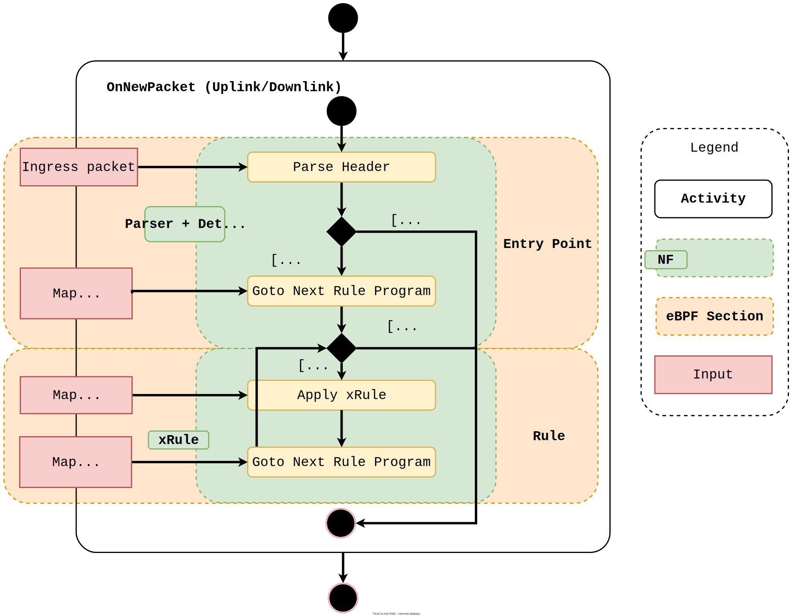
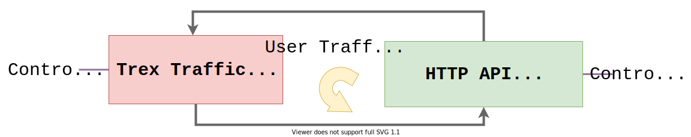

> :memo: NOTE 1: This is still an experimental project. The releases were just for quick access of the artifacts presented in the publications (See [docs](docs/) folder.)
> 
> :memo: NOTE 2: There is task force to improve and integrate the upf-bpf project inside the OAI 5G UPF. See [here](https://gitlab.eurecom.fr/oai/cn5g/oai-cn5g-upf/-/tree/develop/src/upf_app) for more information.

# 5G UPF using BPF/XDP

An open source C++ library powered by BPF/XDP for user planes in the mobile core network (5G/LTE).

The key pillars of this project are:

- In-kernel fast packet processing
- Flexible and programmable dataplane
- Portable to different systems

These points are achieved mainly by BPF/XDP and CO-RE (Compile Once - Run Everywhere) technologies.

This project is based on the following 3GPP Technical Specification:
- LTE; 5G; Interface between the Control Plane and the User Plane nodes (3GPP TS 29.244 version 16.5.0 Release 16)
- 5G; System architecture for the 5G System (5GS) (3GPP TS 23.501 version 16.5.0 Release 16)

The main goal is to enable in-kernel fast packet processing in third-party UPF/5G or SPGWu/LTE components in order to:
1. Boost them for those which does not have any fast packet processing enabled, or
2. Co-locate them with other fast packet processing solutions (e.g. DPDK)

Possible scenarios that take advantage of this type of technology: MEC, 5G NPN (Non Public Networks), on-premise, 5G enterprise, and much more.

## Design

The library is divided in layers:
- **Management Layer**: An user space layer responsible to receive requests from the third-party UPF/SPGWu components to manage PFCP sessions and BPF programs lifecycle
- **Datapath Layer**: A kernel space layer representing by BPF/XDP programs responsible to handle the user traffic (datapath) for fast packet processing

The high level design is shown in figure below.


The library has a component, called `PFCP Session Manager`, which is a C++ API responsible for managing PFCP (Packet Forwarding Control Protocol) sessions. This layer selects the highest PDR and its rules for each PFCP session to compose the datapath Linux kernel. It is the `eBPF Program Manager`, which is responsible for loading/unloading the BPF programs. The BPF program is mapped to each rule defined in highest precedence PDR (e.g. FAR) for each PFCP session created. The fast path is composed of three main functions: Parser, Detection (both in entry BPF section) and Rule. The image below shows this in more detail.


- Parser: responsible to parse the GTP and UDP packets
- Detector: responsible for matching the Packet Detection Information (TEID, source interface and UE IP address) with the header of the packet. If matches, so the rules of the PFCP session context must be applied
- Rule: responsible to encapsulate the logic of one rule (e.g. FAR, QER, BAR, etc). Depending on the PFCP session context, it might have more than one rule available in the datapath.

> The FAR is mandatory according to the 3GPP specification

A low-level design (Datapath Layer) is shown below.



### Activity Diagrams

Figure: PFCP session creation activity diagram in Management Layer.


Figure: On new packet received activity diagram in Datapath Layer. There are two pipeline: one with only the FAR and the other one with QER and FAR.


## Features

As described in 3GPP TS 29.244, the Information Elements (IEs) are part of the PFCP context. The PFCP context is created by sending a PFCP Session Establishment Request message. The main features supported in this project are:

Management Layer - CRUD
- PFCP Session
- PDR (Packet Detection Rule)
- FAR (Forwarding Action Rule)

Fast Datapath Layer
- UDP and GTP parse
- Traffic detection based on PDR
- Traffic forwarding based on FAR

The logical data model between PFCP Session and IEs is shown in the image below. For more detail, see 3GPP TS 29.244 version 16.5.0 Release 16.


## :construction: Future Work

- QER (QoS Enforcement Rule)
- CO-RE for tracing.
- PoC with OpenAirInterface

## Main Dependencies

Core
- libbpf
- bpftool
- spdlog
- clang >= version 3.4.0
- llvm >= version 3.7.1
- kernel-headers => version 5.4
- cmake >= 3.16

Test
- trex v2.86
- sysstat (mpstat)
- ethtool
- gtest

## First Steps

First of all, make sure you have installed [git-lfs](https://git-lfs.github.com/). The LFS repository is used to store the `bpftool` binary.

After downloaded and installed it, clone this repository:

```
git clone https://github.com/navarrothiago/upf-bpf.git
```

After cloning the repository, configure your [env.sh](env.sh) file (on the repository root folder) to match your dev or test environment, using the [.env.sample.sh](.env.sample.sh) file as a template

The project uses a docker container to build the UPF library. The command below will provision the docker image with all the project dependencies.

> :memo: You'll need the Docker Container Runtime package and the Docker Compose utility to set up the dev or test environment

```
make docker-build
```

After that, run the container with:

```
make docker-run
```

> You can also use the vscode development container feature to build the image and login into the container.
> Check [here](https://code.visualstudio.com/docs/remote/create-dev-container#_create-a-devcontainerjson-file) to understand how to open the [devcontainer.json](.devcontainer/devcontainer.json) file.

Inside the container, compile the dependencies with

```
make setup
```

## Build and Installation

The library is built and installed with

```
make install
```

The `package` folder is created with the headers, library and some binaries for testing.

```
package
├── bin       # Contains binaries for testing
├── include   # Contains headers
├── lib       # Contains libupf_xdp.a library
└── tests     # Contains scripts for testing
```

## How to Test

The test is based on RFC2544-like measurements. The testbed is composed of two servers: Trex Traffic Generator and HTTP API + upf-bpf.

Requirements:

- Both machines with Ubuntu 20.04.02 LTS installed with Linux kernel v5.4.0-72-generic. One machine is used to generate user traffic with TRex Traffic Generator and the other is the DUT (Device Under Test) where the upf-bpf is deployed.
- Both machine contains two NICs
  - For the Trex traffic generator, both NICs drivers must support DPDK. Check out the [Table 5 - Supported NICs](https://trex-tgn.cisco.com/trex/doc/trex_manual.html#_download_and_installation)
  - For DUT, both NICs drivers must support XDP. Check out [here](https://github.com/iovisor/bcc/blob/master/docs/kernel-versions.md#xdp).


Test environment:



### Setup Trex Traffic Generator Server

This machine must have installed the Trex traffic generator. You can check the [trex manual](https://trex-tgn.cisco.com/trex/doc/trex_manual.html) or you can based on the scripts that are called when `make trex` is executed (unstable).

### Setup HTTP API + upf-bpf Server

After running `make install` inside the docker container, copy the application `./package/bin/api` to the DUT machine. **Your host must have kernel >= v5.4**.

Steps:
1. Run Trex Traffic Generator
1. Run HTTP API + upf-bpf
1. Configure interfaces (/configure)
1. Create PFCP Session context (/createSession)
1. Configure the number of Rx queue in DUT
1. Generate the GTP/UDP flows (pkt size = 64B)
1. Collects metrics (CPU load, packet loss, throughput)

For step 1, see the [trex manual](https://trex-tgn.cisco.com/trex/doc/trex_manual.html)

For step 2, run HTTP API + upf-bpf with:
```
sudo ./bin/api 10.1.1.27 80
```

For steps 3 and 4, there are Postman files are available: [Uplink](tests/api/requests_body/gtp-postman-colletion.json) and [Downlink](tests/api/requests_body/udp-postman-colletion.json). Check the JSON message for each step.

For steps 5, 6 and 7, it was implemented a Python [script](https://github.com/navarrothiago/upf-bpf/blob/c1250469a101a10c4b7ac38503a6edda6c5ca1f1/tests/trex/test_cases/run.py) to automate the process. The script executes the test case varying the number of the rx queue. In the end, a report is generated based on JSON format with all the metrics (i.e throughput and CPU load) for each execution. The flows leverage the [Trex Field Engine](https://trex-tgn.cisco.com/trex/doc/cp_stl_docs/api/field_engine.html) to generate the flows. You can also generate the flow manually in the Trex Traffic Generator server.

In order to execute the script, run the following command inside the docker container:
```
export PYTHONPATH='/workspaces/tests/trex/trex_client/interactive/'

# example to generate GTP flow with 12mpps of throughput.
./tests/trex/test_cases/run.py -m 12mpps -p <password_trex_server> -f gtp
# example to generate UDP flow with 100% of throughput.
./tests/trex/test_cases/run.py -m 100% -p <password_trex_server> -f udp
```

> :memo: The `env.sh` file must be configured properly in order to have a successful execution.

There is a tmux session script available [here](tests/scripts/start_session) that were developed to a specific scenario. Some parameters are hardcoded. Feel free to change according to your needs. If you need any help, open an issue or contact me. PR are welcome!!


> :warning: Some scripts were developed to work in one environment. As you can see in [.env.sample.sh](.env.sample.sh), there are variables to configure the jump server, trex version, GTP and UDP interfaces (downlink and uplink), etc. **You might face some problems when trying to execute some of them, because they were not exhaustive tests in other environments.**

### UTs

Some UTs were developed for the Session Management layer. You can execute inside the container:

```
make config-veth-pair
make build-tests
make run-session-manager-tests
```
If you face any problem, feel free to open an issue or contact me.

## :rocket: Benchmark

Setup: Intel(R) Xeon(R) CPU E5-2620 v2 @ 2.10GHz, 32GiB of the DRAM, 15M of L3 cache, 6 cores (hyper-threading disabled), dual-port 82599ES 10-Gigabit SFI/SFP+ NIC. Both machines have Ubuntu 20.04.02 LTS installed with Linux kernel v5.4.0-72-generic.

> Disable the hyper-threading with `echo off > /sys/devices/system/cpu/smt/control`

**Downlink** | **Uplink**
---|---
| 
| 

Check the [Jupyter notebook](notebook.ipynb) to see how the graphics are generated.

> :memo: For more graphics, check [this](tests/reports/img) folder.

Time spent to inject BPF program into the kernel after receive the PFCP Establishement Request message.

**Version**| **BPF section** | **BPF Insn** | **Injection (ms)**
--|--|--|--
v1.0.0|PFCP Session|402|27
v2.0.0|FAR|272|1

> :memo: The main reason is due the logic related to lookup the PDR is implemented in the control plane (Management Layer) in v2.0.0 and in the data plane in v1.0.0. The PFCP session was composed with only one FAR.

### Jupyter Notebook

The data collected for uplink (GTP decapsulation) and downlink (GTP encapsulation) e2e testing are available:

- [Uplink - GTP Decapsulation Report](tests/reports/v2.0.0/UplinkMaxThoughtput.json)
- [Downlink - GTP Encapsulation Report](tests/reports/v2.0.0/DownlinkMaxThoughtput.json)

 Firstly, you need to install the python dependencies:

```
# create our virtual environment
python3 -m venv env
# activate our virtual environment
source env/bin/activate
# install dependencies
pip3 install -r requirements.txt
```

Now, you can execute [notebook](notebook.ipynb) using Jupyter.

## Tree

```
├── build: Generated build directory.
├── cmake: Cmake files configuration directory
├── extern: Submodule repositories
├── include: Include files
├── samples: Samples like XDP BPF hello world
├── src: Source files directory
├── tests: UTs, HTTP API srcs, scripts for testing, trex installation
├── Makefile: Encapsulate cmake calls for build, run samples, clean, etc
└── README.md: Readme file
```

## Trex Traffic Generator

If you faced `FileNotFoundError: [Errno 2] No such file or directory: b'liblibc.a'` when executing trex, for instance:
```
 cd tests/scripts/../trex/v2.87; sudo ./trex-console --port 1235 --async_port 1236
```
Create a symbolic from `libc.a -> liblibc.a` (Manjaro)

```
sudo ln -s -f /usr/lib64/libc.a /usr/lib64/liblibc.a
```


## Contribute

If you think this could be better, **please open an issue or start a discussion**.

PRs ARE WELCOME :+1:

## :star: BibTeX

The paper is available [here](docs/Paper___An_In_Kernel_Solution_Based_on_XDP__Design__Prototype_and_Performance_Evaluation.pdf).

```bibtex
@INPROCEEDINGS{Amar2110:Kernel,
AUTHOR="Thiago Arruda Navarro do Amaral and Raphael {Vicente Rosa} and David Moura
and Christian {Esteve Rothenberg}",
TITLE="An {In-Kernel} Solution Based on {XDP} for {5G} {UPF:} Design, Prototype
and Performance Evaluation",
BOOKTITLE="2021 1st Joint International Workshop on Network Programmability and
Automation (NetPA 2021)",
ADDRESS="Izmir, Turkey, Turkey",
DAYS=24,
MONTH=oct,
YEAR=2021,
KEYWORDS="5G; XDP; UPF",
ABSTRACT="The edge computing infrastructure can scale from datacenters to single
device. The well-known technology for fast packet processing is DPDK, which
has outstanding performance regarding the throughput and latency. However,
there are some drawbacks when the usage is done in the edge: (i) the
polling mechanism for packet processing keeps the CPU exclusively occupied
even if there is no traffic, leading to wasted resources; and (ii) DPDK
interface becomes unavailable for the applications inside the host, so the
integration between a non-DPDK application and a DPDK application becomes a
hard task. In this paper, we propose an open-source in-kernel 5G UPF
solution based on 3GPP Release 16 to be deployed in a restrictive
environment like MEC, where MEC host and UPF are collocated with the Base
Station, sharing the same computational and network resources. The solution
leverages the eBPF/XDP, a novel Linux kernel technology for fast packet
processing. We show it can scale and achieve 10 Mpps using only 60\% of the
CPU with 6 cores."
}
```

## :notebook: Contacts

- [Discord Server](https://discord.gg/TtdUvnA4nq)
- Mail: <navarro (dot) ime (at) gmail [dot] com>
- Twitter: [@navarr0thiag0](https://twitter.com/navarr0thiag0)

## :information_source: References

- [Paper - Run-time Adaptive In-Kernel BPF/XDP Solution for 5G UPF](docs/Paper___Run-time_Adaptive_In-Kernel_BPF_XDP_Solution_for_5G_UPF.pdf)
- [Paper - An In-Kernel Solution Based on XDP for 5G UPF: Design, Prototype and Performance Evaluation](docs/Paper___An_In_Kernel_Solution_Based_on_XDP__Design__Prototype_and_Performance_Evaluation.pdf)
- [Video - Project Overview](https://youtu.be/Av_k_fZKCfM)
- [Slides - Project Overview](https://docs.google.com/presentation/d/1osOheCFV3c3wn4hDbo5R3coL8nDeaxjVb7D33QT41jw/edit?usp=sharing)
- [Video - Performance Evaluation with UPF eBPF/XDP Library for 5G Core Network](https://www.youtube.com/watch?v=6KYFDMJJH2o)
